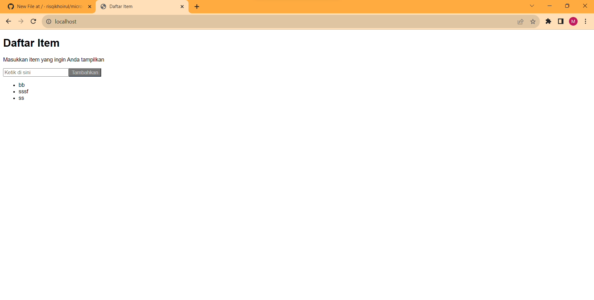

# Dicoding Microservices Submission 1: Proyek Deploy Aplikasi Item App dengan Docker Compose
## 1. Pengaturan Proyek
Garpu repositori ke akun GitHub pribadi Anda.

Tangkapan layar 12-09-2023 pukul 16.33.44.png

Kloning cabang "proyek-pertama" dari repositori bercabang.

```
git clone https://github.com/<Your GitHub Username>/a433-microservices.git -b proyek-pertama proyek-pertama
```

Buat token akses pribadi GitHub dengan cakupan akses "write:packages" untuk memasukkan image ke Paket GitHub dengan mengikuti langkah-langkah berikut:

Kunjungi halaman web GitHub Personal Access Tokens , dan klik "Buat token baru" -> "Buat token baru (klasik)" untuk membuat token baru.

Beri nama token dengan mengisi kolom "Catatan". Kemudian periksa cakupan akses "tulis: paket" untuk memberikan izin pada token.

Gulir ke bawah ke bagian bawah halaman web dan klik tombol "Buat token". Salin nilai yang dihasilkan.

Setel variabel lingkungan "GHCR_TOKEN" dengan token akses yang dibuat sebelumnya.

```
export GHCR_TOKEN=<GitHub Packages Token>
```

Instal Docker Desktop .

## 2. Membangun dan Mendorong Citra Aplikasi
Buka folder aplikasi.
```
cd <Project Root Directory>
cd proyek-pertama
```
Buat file Docker.
```
nano Dockerfile
```
Salin dan tempel konten berikut:

```
# Use Node.js version 14 as the base image
FROM node:14

# Set the working directory for the container
WORKDIR /app

# Copy all source code to the working directory in the container
COPY . .

# Ensure the application runs in production mode and uses "item-db" as the database host
ENV NODE_ENV=production DB_HOST=item-db

# Install production dependencies and build the application
RUN npm install --production --unsafe-perm && npm run build

# Expose port 8080 used by the application
EXPOSE 8080

# When the container is launched, execute the command "npm start"
CMD ["npm", "start"]
```
Buat file "build_push_image.sh".

nano build_push_image.sh
Salin dan tempel konten berikut:

```
#!/bin/bash

# Build a Docker image from the Dockerfile
docker build -t item-app:v1 .

# List local Docker images
docker images

# Rename the image to match GitHub Packages format
docker tag item-app:v1 ghcr.io/<Your GitHub Username>/item-app:v1

# Log in to GitHub Packages
echo $GH_PACKAGES_TOKEN | docker login ghcr.io -u <Your GitHub Username> --password-stdin

# Push the image to GitHub Packages
docker push ghcr.io/<Your GitHub Username>/item-app:v1
```
Jalankan file "build_push_image.sh".
```
chmod 777 build_push_image.sh
```
```
./build_push_image.sh
```
```
MSI GAMING@MSI MINGW64 /d/proyek-pertama (proyek-pertama)$ ./build_push_image.sh
[+] Building 79.2s (10/10) FINISHED
 => [internal] load build definition from Dockerfile                                                                                                                                                     0.2s
 => => transferring dockerfile: 643B                                                                                                                                                                     0.1s
 => [internal] load .dockerignore                                                                                                                                                                        0.2s
 => => transferring context: 89B                                                                                                                                                                         0.1s
 => [internal] load metadata for docker.io/library/node:14                                                                                                                                               3.6s
 => [auth] library/node:pull token for registry-1.docker.io                                                                                                                                              0.0s
 => [1/4] FROM docker.io/library/node:14@sha256:a158d3b9b4e3fa813fa6c8c590b8f0a860e015ad4e59bbce5744d2f6fd8461aa                                                                                         0.0s
 => [internal] load build context                                                                                                                                                                        0.7s
 => => transferring context: 2.97MB                                                                                                                                                                      0.6s
 => CACHED [2/4] WORKDIR /app                                                                                                                                                                            0.0s
 => [3/4] COPY . .                                                                                                                                                                                       0.2s
 => [4/4] RUN npm install --production --unsafe-perm && npm run build                                                                                                                                   71.7s 
 => exporting to image                                                                                                                                                                                   2.5s 
 => => exporting layers                                                                                                                                                                                  2.5s 
 => => writing image sha256:6ce0b55ae831e7f22523a1b63ebc838f39fc4b64e94bc2fadc372c4f58454724                                                                                                             0.0s 
 => => naming to docker.io/library/item-app:v1                                                                                                                                                           0.0s 
REPOSITORY                    TAG       IMAGE ID       CREATED         SIZE
item-app                      v1        6ce0b55ae831   3 seconds ago   949MB
registry                      2         0030ba3d620c   2 months ago    24.1MB
gcr.io/k8s-minikube/kicbase   v0.0.40   c6cc01e60919   3 months ago    1.19GB
Login Succeeded
The push refers to repository [ghcr.io/risqikhoirul/item-app]
5a25f7689102: Pushed
bdd8f6a5bbd9: Pushed
1971efa9cefe: Pushed
0d5f5a015e5d: Mounted from risqikhoirul/tugas1-webframwork
3c777d951de2: Mounted from risqikhoirul/tugas1-webframwork
f8a91dd5fc84: Mounted from risqikhoirul/tugas1-webframwork
cb81227abde5: Mounted from risqikhoirul/tugas1-webframwork
e01a454893a9: Mounted from risqikhoirul/tugas1-webframwork
c45660adde37: Mounted from risqikhoirul/tugas1-webframwork
fe0fb3ab4a0f: Mounted from risqikhoirul/tugas1-webframwork
f1186e5061f2: Mounted from risqikhoirul/tugas1-webframwork
b2dba7477754: Mounted from risqikhoirul/tugas1-webframwork
v1: digest: sha256:6244fa520f63144fef6398e856404738ba716dec55a9b19c4acf80b14078a23b size: 2844
```

Navigasikan ke halaman web akun GitHub Anda dan lihat gambar yang dikirim di bawah "Paket".


Sesuaikan visibilitas ke publik untuk memenuhi persyaratan penugasan dengan melakukan langkah-langkah berikut:

Klik nama gambar
Klik "Pengaturan paket"
Gulir ke bawah ke panel "Zona Bahaya" dan klik tombol "Ubah visibilitas".
Pilih publik di bawah pop-up Ubah visibilitas. Kemudian ketikkan nama gambar pada kolom yang tersedia dan klik tombol “Saya mengerti konsekuensinya, ubah visibilitas paket”.
Label "pribadi" di samping nama gambar seharusnya disembunyikan sekarang.

## 3. Men-deploy Aplikasi dengan Docker Compose
Buat file "buruh pelabuhan-compose.yml".

```
nano docker-compose.yml
```
Salin dan tempel konten berikut:

```
version: '2'

services:
  # Service for the item-app application
  item-app:
    image: ghcr.io/<Your GitHub Username>/item-app:v1
    ports:
      - "80:8080"  # Map port 80 on the host to port 8080 in the container
    depends_on:
      - item-db  # Ensure that "item-db" is running before starting "item-app"
    restart: always  # Set the container restart policy to always

  # Service for the item-db database
  item-db:
    image: mongo:3
    volumes:
      - app-db:/data/db  # Use the "app-db" volume to store database data

volumes:
  app-db:  # Define the "app-db" volume
```
Terapkan file "docker-compose.yml" untuk menjalankan container.

```
docker compose up -d
```
```
MSI GAMING@MSI MINGW64 /d/proyek-pertama (proyek-pertama)$ docker compose up -d
[+] Running 14/14
 ✔ item-db 13 layers [⣿⣿⣿⣿⣿⣿⣿⣿⣿⣿⣿⣿⣿]      0B/0B      Pulled                                                                                                                                             48.8s 
   ✔ 92473f7ef455 Pull complete                                                                                                                                                                         24.0s 
   ✔ fb52bde70123 Pull complete                                                                                                                                                                         24.2s 
   ✔ 64788f86be3f Pull complete                                                                                                                                                                         24.3s 
   ✔ 33f6d5f2e001 Pull complete                                                                                                                                                                         24.3s 
   ✔ 570e56656608 Pull complete                                                                                                                                                                         24.6s 
   ✔ f518a872ab12 Pull complete                                                                                                                                                                         26.2s 
   ✔ c9bdae151f64 Pull complete                                                                                                                                                                         26.5s 
   ✔ b2c58da5f563 Pull complete                                                                                                                                                                         26.6s 
   ✔ 2928038a6053 Pull complete                                                                                                                                                                         26.6s 
   ✔ 29a16c1b79ab Pull complete                                                                                                                                                                         29.1s 
   ✔ efec0f86077c Pull complete                                                                                                                                                                         42.6s 
   ✔ 261a04726d31 Pull complete                                                                                                                                                                         42.7s 
   ✔ 7c4062426e72 Pull complete                                                                                                                                                                         42.8s 
[+] Building 0.0s (0/0)
[+] Running 4/4
 ✔ Network proyek-pertama_default       Created                                                                                                                                                          0.3s 
 ✔ Volume "proyek-pertama_app-db"       Created                                                                                                                                                          0.1s 
 ✔ Container proyek-pertama-item-db-1   Started                                                                                                                                                          5.8s 
 ✔ Container proyek-pertama-item-app-1  Started
```
Anda akan melihat kontainer layanan item-app dan item-db sedang berjalan.


Catat hasil eksekusi Docker Compose dan simpan di "log.txt."

```
docker compose logs > log.txt
```
Periksa aplikasi dengan mengunjungi http://localhost:80 di browser web.


